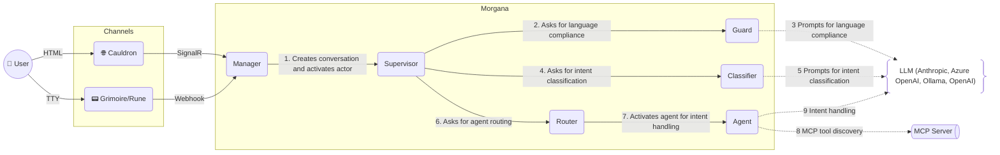

<a href="https://mdesalvo.github.io/Morgana/Morgana-Handbook.html" title="Morgana Handbook">
  
</a>

<p>
  
  
  
  <a href="https://hub.docker.com/r/mdesalvo/morgana"></a>
  <a href="https://hub.docker.com/r/mdesalvo/cauldron"></a>
  <a href="https://hub.docker.com/r/mdesalvo/grimoire"></a>
  <a href="https://hub.docker.com/r/mdesalvo/rune"></a>
  <a href="https://hub.docker.com/r/mdesalvo/alembic"></a>
</p>

Morgana is a modern and flexible **conversational AI framework** designed to handle complex scenarios through a sophisticated **multi-agent, intent-driven architecture**. Built on cutting-edge **.NET 10** and leveraging the actor model via **Akka.NET**, Morgana orchestrates specialized **AI agents** that collaborate to understand, classify and resolve customer inquiries with precision and context awareness.

The system is powered by **Microsoft.Agents.AI**, enabling seamless integration with Large Language Models (LLMs) while maintaining strict governance through guard rails and policy enforcement.

> [!IMPORTANT]
> *Morgana looks like an enchanted LLM seamlessly bound to your application domain: her grimoire holds every spell and tool required to serve your specific world of intents, as you (as developer) are the sole master who whispers the teachings that shape her personality and magical capabilities 🔮*

<table style="border:none;">
  <tr>
    <th colspan=6>Cauldron / Widget</th>
  </tr>
  <tr>
    <td>
      
    </td>
    <td>
      
    </td>
    <td>
      
    </td>
    <td>
      
    </td>
    <td>
      
    </td>
    <td>
      
    </td>
  </tr>
  <tr>
    <th colspan=6>Grimoire</th>
  </tr>
  <tr>
    <td>
      
    </td>
    <td>
      
    </td>
    <td>
      
    </td>
    <td>
      
    </td>
    <td>
      
    </td>
    <td>&nbsp;</td>
  </tr>
</table>

## Core Philosophy

Traditional chatbot systems struggle with complexity. They either become monolithic and unmaintainable, or lack the contextual awareness needed for sophisticated interactions.

Morgana **reimagines conversational AI** through 4 foundational pillars that **work in harmony** to deliver an **orchestration framework** that is powerful yet **remarkably simple to configure**.

<p align="center">
  <a href="#-morgana-actor-system">🎭 Actor System</a> |
  <a href="#-morgana-agent-system">🤖 Agent System</a> |
  <a href="#-morgana-prompt-system">📝 Prompt System</a> |
  <a href="#-morgana-context-system">💾 Context System</a>
</p>

### 🎭 Morgana Actor System
*Resilient multi-channel orchestration through Akka.NET message-driven architecture*

Morgana leverages the **actor model** to create a fault-tolerant, scalable orchestration layer. Each conversation is managed by a hierarchy of **specialized actors that collaborate** through asynchronous message passing:

- **ConversationManager**: Stable entry point owning the lifecycle of a single user session
- **ConversationSupervisor**: Orchestrates the entire conversation flow and coordinates child actors
- **Guard**: Validates every interaction against business policies and brand guidelines
- **Classifier**: Analyzes user intent through LLM-powered classification
- **Router**: Dynamically routes requests to appropriate agents

**Conversation Flow**


```mermaid
graph LR
  U@{shape: circle, label: "👤 User"}

  %% Channels (reference clients, out-of-the-box)
  subgraph Channels["Channels"]
    CLD@{shape: rounded, label: "🌐 Cauldron"}
    RUN@{shape: rounded, label: "📟 Grimoire/Rune"}
  end

  %% Backend boundary
  subgraph Morgana["Morgana"]
    CM@{shape: rounded, label: "Manager"}
    SV@{shape: rounded, label: "Supervisor"}

    G@{shape: rounded, label: "Guard"}
    C@{shape: rounded, label: "Classifier"}
    R@{shape: rounded, label: "Router"}
    MA@{shape: rounded, label: "Agent"}
  end

  %% User → Channel
  U -- HTML --> CLD
  U -- TTY --> RUN

  %% Channel → BE
  CLD -- SignalR --> CM
  RUN -- Webhook --> CM
  CM -- 1. Creates conversation and activates actor --> SV

  %% Internal BE flow
  SV -- 2. Asks for language compliance --> G
  SV -- 4. Asks for intent classification --> C
  SV -- 6. Asks for agent routing --> R
  R -- 7. Activates agent for intent handling --> MA

  %% External systems
  G -. 3 Prompts for language compliance .-> LLM@{shape: braces, label: "LLM (Anthropic, Azure OpenAI, Ollama, OpenAI)"}
  C -. 5 Prompts for intent classification .-> LLM
  MA -. 8 MCP tool discovery .-> MCP@{shape: das, label: "MCP Server"}
  MA -. 9 Intent handling .-> LLM
```

### 🤖 Morgana Agent System
*Declarative specialization with automatic discovery and dynamic capabilities (MCP + A2A)*

Agents in Morgana are **domain specialists** that self-register through **declarative attributes**, eliminating manual configuration and enabling true plugin-based extensibility. Each agent inherits from `MorganaAgent` and declares its responsibilities through simple annotations:

```csharp
[HandlesIntent("billing")]
[RequiresLLMTier(LLMTier.Efficiency)]
[ConsultsAgent("inventory")] // A2A colleague of this installation
[ConsultsAgent("shipping", "acme")] // A2A colleague published by another Morgana
public class BillingAgent : MorganaAgent { ... }

[HandlesIntent("monkeys")]
[RequiresLLMTier(LLMTier.Efficiency)]
[UsesMCPServer("https://func-monkeymcp-3t4eixuap5dfm.azurewebsites.net/")] // MCP tool discovery
public class MonkeyAgent : MorganaAgent { ... }
```

At startup, Morgana automatically discovers all agents across configured assemblies and validates bidirectional consistency between declared intents and classifier configuration: **fail-fast guarantees** ensure errors are caught before reaching production.

Agents express their capabilities through **tools**, which can be native implementations (inherited from `MorganaTool`) and also dynamically acquired from external MCP servers:

```csharp
[ProvidesToolForIntent("billing")]
public class BillingTool : MorganaTool 
{
    public async Task<string> GetInvoices(string customerCode, int count) { ... }
}
```

The **MCP integration** permits agents to extend their capabilities by consuming **Model Context Protocol servers**, making external tools indistinguishable from native implementations. This enables rapid prototyping, microservice integration and ecosystem-driven feature development, all without writing a single line of tool implementation code.

The **A2A integration** allows agents to collaborate behind the scenes, consulting their peers on-demand via competence-driven queries to deliver cross-cutting answers that horizontally cover the entire application domain. This enables seamless peer collaboration, autonomous knowledge sharing and cross-domain reasoning, all without user-facing friction or explicit inter-agent configuration.

### 📝 Morgana Prompt System
*First-class artifacts with layered personality architecture and structured behavioral policies*

Prompts are not hardcoded strings in Morgana—they are **versioned, maintainable project artifacts** managed through the `IPromptResolverService`. This separation of concerns enables prompt engineering teams to iterate independently from application logic, supporting A/B testing, localization and behavioral evolution without redeployment.

The system distinguishes between two prompt categories:
- **System prompts** (`morgana.json`): Define actor behaviors, global policies and orchestration rules
- **Domain prompts** (`agents.json`): Define agent personalities, instructions and tool configurations

A unique characteristic of Morgana is its **Layered Personality System**. Every interaction maintains a consistent global personality (Morgana's core character) while allowing agents to express domain-appropriate specializations:

- **Global Layer**: Defines Morgana's fundamental character, tone and values
- **Agent Layer**: Adds contextual traits that complement (never contradict) the global personality

For example, BillingAgent might be "a pragmatic and concrete witch" while ContractAgent is "a patient and empathetic witch"—both remain recognizably "Morgana" while adapting to domain-specific user needs. This creates vertical consistency across conversations with horizontal variation per expertise area, delivering a **unified brand experience that feels naturally specialized**.

Prompts also define **Global Policies** that are automatically composed into agent instructions, ensuring **system-wide behavioral consistency** without repetition.

### 💾 Morgana Context System
*Private by default, self-synchronizing where it matters*

Every agent in Morgana keeps its own **secure, isolated context**: memories, variables and conversation state that no other agent can see or touch by default. This is what lets a dozen specialized agents work side by side without stepping on each other's toes.

Some information, though, is meant to travel. A customer code given to BillingAgent shouldn't have to be asked again the moment ContractAgent takes over. Morgana handles this with **self-synchronizing shared variables**: information explicitly marked as shared is transparently picked up by any agent that needs it, the instant it needs it (no re-asking the user, no manual wiring between agents).

Conversations survive restarts and agent handoffs without losing this context. Users always see one coherent conversation, even when several specialized agents quietly took turns behind the scenes.

---

## 🚀 Quick Start

```bash
# 📋 Copy the development template
cp development.env.template .env

# ✏️ Configure your secrets
nano .env

# 🔨 Build .NET projects (from project root)
dotnet build ./Morgana
dotnet build ./Channels/Cauldron
dotnet build ./Channels/Grimoire
dotnet build ./Channels/Rune

# 🔨 Alembic, the authoring workbench (optional)
#    Not part of a running Morgana: it talks to no backend, only to an LLM,
#    so it is profile-gated in compose and never started by `up`.
dotnet build ./Alembic/Distiller

# 🐳 Build Docker images
docker compose --env-file .env --env-file .env.versions build

# 🚀 Start the containers (Morgana + Cauldron)
docker compose --env-file .env --env-file .env.versions up

# ✅ Open your browser at http://localhost:5002

# 💬 (Optional) Chat with Morgana via Grimoire's TUI
docker compose --env-file .env --env-file .env.versions run --rm --service-ports --use-aliases grimoire

# 🛑 Stop the containers
docker compose --env-file .env --env-file .env.versions down
```

> [!TIP]
> **Don't hand-write your first domain — distill it.** [**Alembic**](https://mdesalvo.github.io/Morgana/Alembic-Handbook.html) is Morgana's authoring workbench: an AI-conducted interview that turns a domain expert's own words into a ready-to-use Morgana domain (intents, agent prose, tool contracts, C# assets and starter non-regression scenarios), instead of writing `agents.json` and C# by hand. Hand-authoring against the `Morgana.AI` NuGet package is still fully supported for those who prefer it: Alembic is the preferred path to **onboard a new domain** or extend an existing one.
