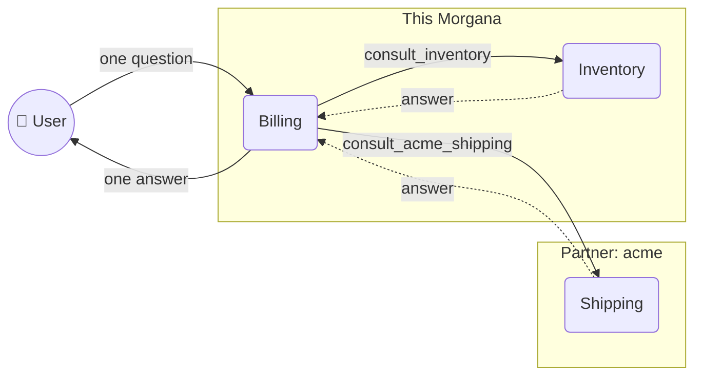

<a href="#"></a>

<p>
  
  
  
  <a href="https://hub.docker.com/r/mdesalvo/morgana"></a>
  <a href="https://hub.docker.com/r/mdesalvo/cauldron"></a>
  <a href="https://hub.docker.com/r/mdesalvo/grimoire"></a>
  <a href="https://hub.docker.com/r/mdesalvo/rune"></a>
  <a href="https://hub.docker.com/r/mdesalvo/alembic"></a>
</p>

Morgana is a modern and flexible **conversational AI framework** designed to handle complex scenarios through a sophisticated **multi-agent, intent-driven architecture**. Built on cutting-edge **.NET 10** and leveraging the actor model via **Akka.NET**, Morgana orchestrates specialized **AI agents** that collaborate to understand, classify and resolve customer inquiries with precision and context awareness.

The system is powered by **Microsoft.Agents.AI**, enabling seamless integration with Large Language Models (LLMs) while maintaining strict governance through guard rails and policy enforcement.


## Core Philosophy

Traditional chatbot systems struggle with complexity. They either become monolithic and unmaintainable, or lack the contextual awareness needed for sophisticated interactions.

Morgana **reimagines conversational AI** through 5 foundational pillars that **work in harmony** to deliver an **orchestration framework** that is powerful yet **remarkably simple to configure**.

<p align="center">
  <a href="#-morgana-actor-system">🎭 Actor System</a> |
  <a href="#-morgana-agent-system">🤖 Agent System</a> |
  <a href="#-morgana-prompt-system">📝 Prompt System</a> |
  <a href="#-morgana-context-system">💾 Context System</a> |
  <a href="#-morgana-channel-system">📡 Channel System</a>
</p>

### 🎭 Morgana Actor System

<details>
<summary><i>Resilient multi-channel orchestration through Akka.NET message-driven architecture</i></summary>

Morgana leverages the **actor model** to create a fault-tolerant, scalable orchestration layer. Each conversation is managed by a hierarchy of **specialized actors that collaborate** through asynchronous message passing:

- **ConversationManager**: Stable entry point owning the lifecycle of a single user session
- **ConversationSupervisor**: Orchestrates the entire conversation flow and coordinates child actors
- **Guard**: Validates every interaction against business policies and brand guidelines
- **Classifier**: Analyzes user intent through LLM-powered classification
- **Router**: Dynamically routes requests to appropriate agents

**Conversation Flow**


```mermaid
graph LR
  U@{shape: circle, label: "👤 User"}

  %% Channels (reference clients, out-of-the-box)
  subgraph Channels["Channels"]
    CLD@{shape: rounded, label: "🌐 Cauldron"}
    RUN@{shape: rounded, label: "📟 Grimoire/Rune"}
  end

  %% Backend boundary
  subgraph Morgana["Morgana"]
    CM@{shape: rounded, label: "Manager"}
    SV@{shape: rounded, label: "Supervisor"}

    G@{shape: rounded, label: "Guard"}
    C@{shape: rounded, label: "Classifier"}
    R@{shape: rounded, label: "Router"}
    MA@{shape: rounded, label: "Agent"}
  end

  %% User → Channel
  U -- HTML --> CLD
  U -- TTY --> RUN

  %% Channel → BE
  CLD -- SignalR --> CM
  RUN -- Webhook --> CM
  CM -- 1. Creates conversation and activates actor --> SV

  %% Internal BE flow
  SV -- 2. Asks for language compliance --> G
  SV -- 4. Asks for intent classification --> C
  SV -- 6. Asks for agent routing --> R
  R -- 7. Activates agent for intent handling --> MA

  %% External systems
  G -. 3 Prompts for language compliance .-> LLM@{shape: braces, label: "LLM (Anthropic, Azure OpenAI, Ollama, OpenAI)"}
  C -. 5 Prompts for intent classification .-> LLM
  MA -. 8 MCP tool discovery .-> MCP@{shape: das, label: "MCP Server"}
  MA -. 9 Intent handling .-> LLM
```

</details>

### 🤖 Morgana Agent System

<details>
<summary><i>Declarative specialization with automatic discovery and dynamic capabilities (MCP + A2A)</i></summary>

Agents in Morgana are **domain specialists** that self-register through **declarative attributes**, eliminating manual configuration and enabling true plugin-based extensibility. Each agent inherits from `MorganaAgent` and declares its responsibilities through simple annotations:

```csharp
[HandlesIntent("billing")]
[RequiresLLMTier(LLMTier.Efficiency)]
[ConsultsAgent("inventory")] // A2A agent discovery (local)
[ConsultsAgent("shipping", "acme")] // A2A agent discovery (remote)
public class BillingAgent : MorganaAgent { ... }

[HandlesIntent("monkeys")]
[RequiresLLMTier(LLMTier.Efficiency)]
[UsesMCPServer("https://func-monkeymcp-3t4eixuap5dfm.azurewebsites.net/")] // MCP tool discovery
public class MonkeyAgent : MorganaAgent { ... }
```

At startup, Morgana automatically discovers all agents across configured assemblies and validates bidirectional consistency between declared intents and classifier configuration: **fail-fast guarantees** ensure errors are caught before reaching production.

Agents express their capabilities through **tools**, which can be native implementations (inherited from `MorganaTool`) and also dynamically acquired from external MCP servers:

```csharp
[ProvidesToolForIntent("billing")]
public class BillingTool : MorganaTool 
{
    public async Task<string> GetInvoices(string customerCode, int count) { ... }
}
```

The **MCP integration** permits agents to extend their capabilities by consuming **Model Context Protocol servers**, making external tools indistinguishable from native implementations. This enables rapid prototyping, microservice integration and ecosystem-driven feature development, all without writing a single line of tool implementation code.

The **A2A integration** allows agents to collaborate behind the scenes, consulting their peers on-demand to deliver cross-cutting answers that horizontally cover the entire application domain. This enables seamless agent collaboration, autonomous knowledge sharing and cross-domain reasoning, all without user-facing friction or explicit inter-agent configuration.

```mermaid
graph LR
  U@{shape: circle, label: "👤 User"}

  subgraph Here["This Morgana"]
    B@{shape: rounded, label: "Billing"}
    I@{shape: rounded, label: "Inventory"}
  end

  subgraph Acme["Partner: acme"]
    S@{shape: rounded, label: "Shipping"}
  end

  U -- one question --> B
  B -- consult_inventory --> I
  I -. answer .-> B
  B -- consult_acme_shipping --> S
  S -. answer .-> B
  B -- one answer --> U
```

A colleague living in the same installation needs nothing configured: that traffic is signed under a key coined at every start. A colleague living in **another Morgana** is one `Morgana:AgentToAgent:Partners[]` entry away, carrying the shared key and one policy per direction (`OutboundPolicy` for the desks consulted there, `InboundPolicy` for the desks reachable from there, with the ceiling on how many conversations that partner may open). Where a colleague runs is a deployment decision and the prose of an agent never says.

</details>

### 📝 Morgana Prompt System

<details>
<summary><i>First-class artifacts with layered personality architecture and structured behavioral policies</i></summary>

Prompts are not hardcoded strings in Morgana—they are **versioned, maintainable project artifacts** managed through the `IPromptResolverService`. This separation of concerns enables prompt engineering teams to iterate independently from application logic, supporting A/B testing, localization and behavioral evolution without redeployment.

The system distinguishes between two prompt categories:
- **System prompts** (`morgana.json`): Define actor behaviors, global policies and orchestration rules
- **Domain prompts** (`agents.json`): Define agent personalities, instructions and tool configurations

A unique characteristic of Morgana is its **Layered Personality System**. Every interaction maintains a consistent global personality (Morgana's core character) while allowing agents to express domain-appropriate specializations:

- **Global Layer**: Defines Morgana's fundamental character, tone and values
- **Agent Layer**: Adds contextual traits that complement (never contradict) the global personality

For example, BillingAgent might be "a pragmatic and concrete witch" while ContractAgent is "a patient and empathetic witch"—both remain recognizably "Morgana" while adapting to domain-specific user needs. This creates vertical consistency across conversations with horizontal variation per expertise area, delivering a **unified brand experience that feels naturally specialized**.

Prompts also define **Global Policies** that are automatically composed into agent instructions, ensuring **system-wide behavioral consistency** without repetition.

</details>

### 💾 Morgana Context System

<details>
<summary><i>Private by default, self-synchronizing where it matters</i></summary>

Every agent in Morgana keeps its own **secure, isolated context**: memories, variables and conversation state that no other agent can see or touch by default. This is what lets a dozen specialized agents work side by side without stepping on each other's toes.

Some information, though, is meant to travel. A customer code given to BillingAgent shouldn't have to be asked again the moment ContractAgent takes over. Morgana handles this with **self-synchronizing shared variables**: information explicitly marked as shared is transparently picked up by any agent that needs it, the instant it needs it (no re-asking the user, no manual wiring between agents).

Conversations survive restarts and agent handoffs without losing this context. Users always see one coherent conversation, even when several specialized agents quietly took turns behind the scenes.

</details>

### 📡 Morgana Channel System

<details>
<summary><i>One brain, every surface: rich where it can be, plain where it must be</i></summary>

Morgana never asks a channel to keep up: it **adapts to whatever capabilities a channel actually declares**. A rich card, a quick reply, a streamed chunk—each is offered only where the channel says it can render it, gracefully degraded to plain text everywhere else, with nothing lost in translation and nothing crashing in the attempt.

The same conversation, the same agents, the same policies: only the surface changes. A browser gets Cauldron's full HTML experience—sparkle loaders, rich cards, a floating widget. A terminal gets Grimoire's rendered TTY equivalent of the very same turns. Neither channel carries a line of agent logic: they are pure presentation, and Morgana is the one that knows, turn by turn, what each of them can take.

<table style="border:none;">
  <tr>
    <th colspan=6>Cauldron</th>
  </tr>
  <tr>
    <td>
      
    </td>
    <td>
      
    </td>
    <td>
      
    </td>
    <td>
      
    </td>
    <td>
      
    </td>
    <td>
      
    </td>
  </tr>
  <tr>
    <th colspan=6>Grimoire</th>
  </tr>
  <tr>
    <td>
      
    </td>
    <td>
      
    </td>
    <td>
      
    </td>
    <td>
      
    </td>
    <td>
      
    </td>
    <td>&nbsp;</td>
  </tr>
</table>

</details>

These pillars are argued at length in the [**Morgana Handbook**](https://mdesalvo.github.io/Morgana/Morgana-Handbook.html).

---

## Hands On!

<p align="center">
  <a href="#-quick-start">🚀 Quick Start</a> |
  <a href="#-authoring-a-domain-alembic">🧪 Alembic</a> |
  <a href="#-morgana-where-your-users-already-are-the-widget">🔮 Widget</a>
</p>

### 🚀 Quick Start

<details>
<summary><i>From a cloned repository to a running Morgana, one channel at a time</i></summary>

<details open>
<summary><b>⚙️ Setup</b> — <i>once, before any channel</i></summary>

```bash
# 📋 Copy the development template
cp development.env.template .env

# ✏️ Configure your secrets
nano .env

# 🔨 Build .NET projects (from project root)
dotnet build ./Morgana
dotnet build ./Channels/Cauldron
dotnet build ./Channels/Grimoire
dotnet build ./Channels/Rune

# 🐳 Build Docker images
docker compose --env-file .env --env-file .env.versions build
```

</details>

<details>
<summary><b>🌐 Morgana on Cauldron</b> — <i>the browser channel and the stack everything else talks to</i></summary>

```bash
# 🚀 Start the containers (Morgana + Cauldron)
docker compose --env-file .env --env-file .env.versions up

# ✅ Open your browser at http://localhost:5002

# 🛑 Stop the containers (when you are done, whichever channel you used)
docker compose --env-file .env --env-file .env.versions down
```

</details>

<details>
<summary><b>📟 Morgana on Grimoire</b> — <i>the rich TTY, on the stack started above</i></summary>

```bash
# --use-aliases is mandatory: without it the webhook callback fails DNS resolution
docker compose --env-file .env --env-file .env.versions run --rm --service-ports --use-aliases grimoire
```

</details>

<details>
<summary><b>📜 Morgana on Rune</b> — <i>the deliberately poor TTY, same stack</i></summary>

```bash
docker compose --env-file .env --env-file .env.versions run --rm --service-ports --use-aliases rune
```

</details>

</details>

### 🧪 Authoring a Domain: Alembic

<details>
<summary><i>An AI-conducted interview that distils a whole domain into a buildable plugin</i></summary>

Agents can be authored entirely by hand — `agents.json` plus a thin C# class against the **Morgana.AI** NuGet package. The shorter path is **Alembic**, Morgana's authoring workbench: an AI-conducted interview that distils a new domain from scratch, or extends an existing one, into intents, agent prose, tool contracts and working C#, packaged as one downloadable archive ready to be built into a plugin. It talks to no Morgana instance — only to an LLM — so it runs on its own, whenever somebody sits down to model a business.

What the interview produces is kept honest over time by **PromptHarness**, the live non-regression suite in the repository root: scenarios run against the configured provider and score the prose the agents actually read.

The interview, what it distils and how the archive is built are walked through in the [**Alembic Handbook**](https://mdesalvo.github.io/Morgana/Alembic-Handbook.html).

<details>
<summary><b>▶️ Running it</b> — <i>a build plus a profile-gated compose service</i></summary>

It joins no network, so compose keeps it behind a profile: `up` never starts it.

```bash
# 🔨 Build it (optional)
dotnet build ./Alembic/Distiller

# 🧪 Model a domain, at http://localhost:5005
docker compose --env-file .env --env-file .env.versions --profile authoring up alembic
```

</details>

</details>

### 🔮 Morgana Where Your Users Already Are: the Widget

<details>
<summary><i>An embeddable launcher that drops a live conversation into a page that already exists</i></summary>

Reaching Morgana from a browser does not require landing on Cauldron: it publishes a launcher any page can host, whatever built it.

```html
<script src="https://your-cauldron-host/widget/morgana-widget.js" defer></script>
```

No parameters: the loader reads its own `src` to learn which Cauldron to open, so a copied snippet points back at the deployment it came from. Closed, it is a floating pill carrying Morgana's animated face; opened, a sandboxed `<iframe>` running the **real** Cauldron chat — streaming, rich cards, quick replies, dust gauge. A closed shadow root keeps the two stylesheets from reaching each other while the iframe keeps the conversation on Cauldron's own origin, unreadable from the host page. Framing stays closed until a site is listed in `Cauldron:Widget:AllowedEmbedOrigins`.

</details>
