<table style="border:none;">
  <tr>
    <td width="256">
      
    </td>
    <td>
      <h1>Morgana</h1>
      <p><strong>A magical witch assistant equipped with an enchanted AI-driven grimoire</strong></p>
      <p>
        
        
        
        
      </p>
      <a href="https://github.com/mdesalvo/Morgana/releases"></a>
      <a href="https://hub.docker.com/r/mdesalvo/morgana"></a>
      <a href="https://hub.docker.com/r/mdesalvo/cauldron"></a>
    </td>
  </tr>
</table>

## Overview 

Morgana is a **conversational AI framework** designed to handle complex scenarios through a sophisticated **multi-agent intent-driven architecture**. Built on cutting-edge **.NET 10** and leveraging the actor model via **Akka.NET**, Morgana orchestrates specialized **AI agents** that collaborate to understand, classify and resolve customer inquiries with precision and context awareness.

The system is powered by **Microsoft.Agents.AI**, enabling seamless integration with Large Language Models (LLMs) while maintaining strict governance through guard rails and policy enforcement.

Morgana will kindly assist you with her magical AI potions just the way you **need**, just the way you **want**.

## Core Philosophy

Traditional chatbot systems struggle with complexity—they either become monolithic and unmaintainable, or lack the contextual awareness needed for sophisticated interactions. Morgana reimagines conversational AI through four foundational pillars that work in harmony to deliver an orchestration framework that is powerful yet remarkably simple to configure.

### 🎭 Morgana Actor System
*Resilient orchestration through Akka.NET message-driven architecture*

Morgana leverages the **actor model** to create a fault-tolerant, scalable orchestration layer. Each conversation is managed by a hierarchy of specialized actors that collaborate through asynchronous message passing:

- **ConversationManager**: Stable entry point owning the lifecycle of a single user session
- **ConversationSupervisor**: Orchestrates the entire conversation flow and coordinates child actors
- **Guard**: Validates every interaction against business policies and brand guidelines
- **Classifier**: Analyzes user intent through LLM-powered classification
- **Router**: Dynamically routes requests to appropriate agents and serves as message bus for P2P context synchronization

This architecture ensures that failures are isolated, system state remains consistent, and conversations can scale horizontally without bottlenecks.

**Morgana Conversation Flow**

```mermaid
graph LR
  %% Frontend
  U@{shape: circle, label: "👤 User"} --> CLD@{shape: rounded, label: "🌐 Cauldron"}

  %% Backend boundary
  subgraph Morgana["Morgana Framework"]
    CM@{shape: rounded, label: "Manager"}
    SV@{shape: rounded, label: "Supervisor"}

    G@{shape: rounded, label: "Guard"}
    C@{shape: rounded, label: "Classifier"}
    R@{shape: rounded, label: "Router"}
    MA@{shape: rounded, label: "Agent"}
  end

  %% FE → BE
  CLD --> CM
  CM -- 1. Creates conversation and activates actor --> SV

  %% Internal BE flow
  SV -- 2. Asks for language compliance --> G
  SV -- 4. Asks for intent classification --> C
  SV -- 6. Asks for agent routing --> R
  R -- 7. Activates agent for intent handling --> MA

  %% External systems
  G -. 3 Prompts for language compliance .-> LLM@{shape: braces, label: "LLM (Azure OpenAI, Anthropic)"}
  C -. 5 Prompts for intent classification .-> LLM
  MA -. 8 MCP tool discovery .-> MCP@{shape: das, label: "MCP Server"}
  MA -. 9 Intent handling .-> LLM
```



**Agent Conversation Flow**

```mermaid
graph LR
  %% Frontend
  U@{shape: circle, label: "👤 User"} --> CLD@{shape: rounded, label: "🌐 Cauldron"}

  %% Backend boundary
  subgraph Morgana["Morgana Framework"]
    CM@{shape: rounded, label: "Manager"}
    SV@{shape: rounded, label: "Supervisor"}

    G@{shape: rounded, label: "Guard"}
    MA@{shape: rounded, label: "Agent"}
  end

  %% FE → BE
  CLD --> CM
  CM -- 1. Continues conversation and engages actor --> SV

  %% Internal BE flow
  SV -- 2. Asks for language compliance --> G
  SV -- 4. Engages agent for intent handling --> MA

  %% External systems
  G -. 3 Prompts for language compliance .-> LLM@{shape: braces, label: "LLM (Azure OpenAI, Anthropic)"}
  MA -. 5 Intent handling .-> LLM
```



### 🤖 Morgana Agent System
*Declarative specialization with automatic discovery and dynamic capabilities*

Agents in Morgana are domain specialists that self-register through **declarative attributes**, eliminating manual configuration and enabling true plugin-based extensibility. Each agent inherits from `MorganaAgent` and declares its responsibilities through simple annotations:

```csharp
[HandlesIntent("billing")]
public class BillingAgent : MorganaAgent { }
```

At startup, Morgana automatically discovers all agents across configured assemblies and validates bidirectional consistency between declared intents and classifier configuration—**fail-fast guarantees** ensure errors are caught before reaching production.

Agents express their capabilities through **tools**, which can be native implementations or dynamically acquired from external MCP servers:

```csharp
[ProvidesToolForIntent("billing")]
public class BillingTool : MorganaTool 
{
    public async Task<string> GetInvoices(string userId, int count) { }
}

[UsesMCPServers("MonkeyMCP")]
public class MonkeyAgent : MorganaAgent { }  // Acquires tools at runtime!
```

The **MCP integration** is particularly powerful: agents can extend their capabilities by consuming Model Context Protocol servers, where external tools become indistinguishable from native implementations. This enables rapid prototyping, microservice integration, and ecosystem-driven feature development—all without writing a single line of tool implementation code.

The framework provides adapters (`MorganaAgentAdapter`, `MorganaToolAdapter`) that bridge the declarative configuration with runtime activation, handling validation, dependency injection, and lifecycle management transparently.

### 📝 Morgana Prompting System
*First-class artifacts with layered personality architecture*

Prompts are not hardcoded strings in Morgana—they are **versioned, maintainable project artifacts** managed through the `IPromptResolverService`. This separation of concerns enables prompt engineering teams to iterate independently from application logic, supporting A/B testing, localization, and behavioral evolution without redeployment.

The system distinguishes between two prompt categories:
- **System prompts** (`morgana.json`): Define actor behaviors, global policies, and orchestration rules
- **Domain prompts** (`agents.json`): Define agent personalities, instructions, and tool configurations

A unique characteristic of Morgana is its **Layered Personality System**. Every interaction maintains a consistent global personality (Morgana's core character) while allowing agents to express domain-appropriate specializations:

- **Global Layer**: Defines Morgana's fundamental character, tone, and values
- **Agent Layer**: Adds contextual traits that complement (never contradict) the global personality

For example, BillingAgent might be "pragmatic and concrete" while ContractAgent is "patient and empathetic"—both remain recognizably "Morgana" while adapting to domain-specific user needs. This creates vertical consistency across conversations with horizontal variation per expertise area, delivering a unified brand experience that feels naturally specialized.

Prompts also define **Global Policies** (critical rules like context handling, interaction tokens) that are automatically composed into agent instructions, ensuring system-wide behavioral consistency without repetition.

### 💾 Morgana Context System
*Distributed memory with encrypted persistence and P2P synchronization*

Morgana extends **Microsoft.Agents.AI** framework with a sophisticated context management layer that balances isolation, sharing, and persistence. Each agent maintains its own isolated context through `MorganaAIContextProvider`, a custom implementation that manages both conversation history and stateful variables.

**Context isolation** ensures agents operate independently—their memories, variables, and state remain private by default. However, the system enables selective **P2P synchronization** for shared variables declared in configuration:

```json
{
  "Name": "userId",
  "Scope": "context",
  "Shared": true
}
```

When one agent collects shared information (e.g., customer ID), the `RouterActor` broadcasts updates to all other agents through a publish/subscribe mechanism. This eliminates redundant user interactions—information provided once becomes available everywhere, creating a seamless multi-agent experience.

**Conversation persistence** is handled through the `IConversationPersistenceService` abstraction, with a default SQLite implementation providing enterprise-grade security. Each agent's context and message history are encrypted using industry-standard algorithms and stored per-conversation, enabling sessions to resume across application restarts without losing context.

The persistence layer supports **multi-agent history reconciliation**: while agents maintain isolated threads, Morgana reconstructs a unified timeline for UI presentation, giving users an uninterrupted conversational experience regardless of which agents participated behind the scenes.

This architecture delivers three critical benefits: **data security** through encryption and isolation, **intelligent context sharing** via P2P sync, and **resilient conversations** that survive system restarts—all configurable through declarative JSON rather than imperative code.

---

**The Morgana Difference**: These four pillars work together to create an orchestration framework where adding a new domain agent requires only configuration and attribute decoration—no changes to the core framework, no manual registration, no brittle coupling. It's conversational AI architecture designed for evolution at scale.
